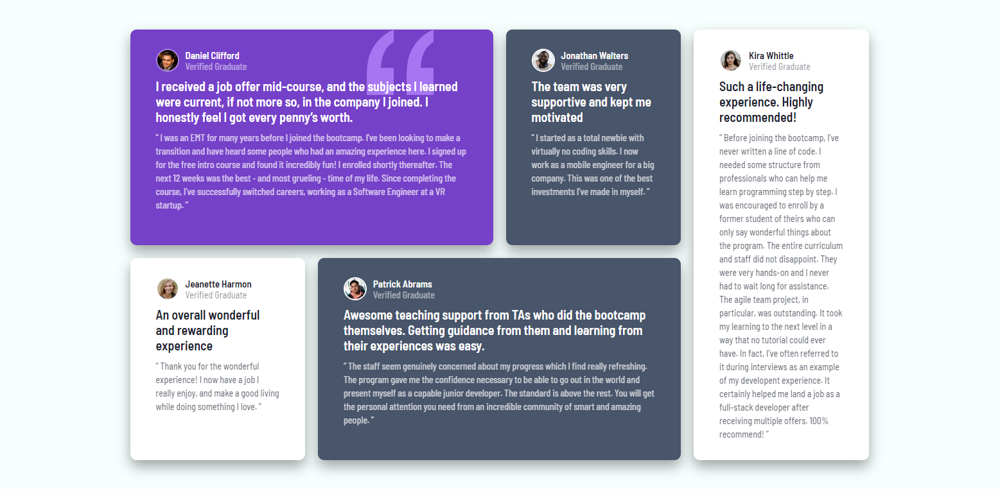
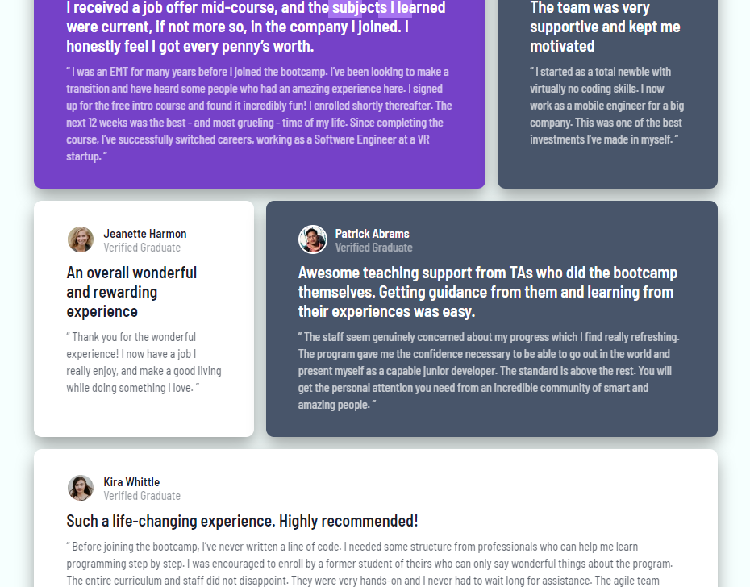
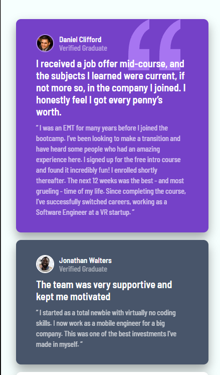

# a003
 Testimonials grid section

# Frontend Mentor - Testimonials grid section solution

This is a solution to the [Testimonials grid section challenge on Frontend Mentor](https://www.frontendmentor.io/challenges/testimonials-grid-section-Nnw6J7Un7). Frontend Mentor challenges help you improve your coding skills by building realistic projects. 

## Table of contents

- [Overview](#overview)
  - [Screenshot](#screenshot)
  - [Links](#links)
- [My process](#my-process)
  - [Built with](#built-with)
  - [What I learned](#what-i-learned)
  - [Continued development](#continued-development)
  - [Useful resources](#useful-resources)
- [Author](#author)
- [Acknowledgments](#acknowledgments)

**Note: Delete this note and update the table of contents based on what sections you keep.**

## Overview

### Screenshot





### Links

- Live Site URL: (https://jp-mainieri.github.io/a003/)

## My process

### Built with

- Semantic HTML5
- CSS
- Flexbox
- CSS Grid
- CSS FlexBox

### What I learned

```html
 <article class="card" name="Daniel">
      <section class="card-user">
        
        <div class="card-user-text">
          <h1>Daniel Clifford</h1>
          <h2>Verified Graduate</h2>
        </div>
      </section>
      <div class="card-heading">
        <p>
          I received a job offer mid-course, and the subjects I learned were current, if not more so,
          in the company I joined. I honestly feel I got every penny’s worth.
        </p>
      </div>
        <div class="card-details">
          <p>
          “ I was an EMT for many years before I joined the bootcamp. I’ve been looking to make a
          transition and have heard some people who had an amazing experience here. I signed up
          for the free intro course and found it incredibly fun! I enrolled shortly thereafter.
          The next 12 weeks was the best - and most grueling - time of my life. Since completing
          the course, I’ve successfully switched careers, working as a Software Engineer at a VR startup. ”
        </p>
      </div>
    </article>
```
```css
    body {
  display: flex;
  justify-content: center;
  align-items: center;
  min-height: 100vh;
  background-color: rgb(246, 255, 254);
}
main {
  display: grid;
  max-width: 1150px;
  grid-template-columns: repeat(4, 1fr);
  grid-template-rows: min-content;
  grid-gap: 20px;
}

    @media (max-width: 1024px) {
  body {
    padding: 20px;
  }
  main {
    grid-template-columns: repeat(3, 1fr);
    grid-template-rows: repeat(3, min-content);
    width: 95%;
    grid-gap: 15px;
  }
  .card[name="Daniel"] {
    grid-column: 1/3;

  }
  .card[name="Jonathan"] {
    grid-column: 3/4;
 
  }
  .card[name="Kira"] {
    grid-column: 1/4;
    grid-row: 3/4;
  }
}

@media (max-width: 768px) {
    main {
        margin-top: 20px;
        grid-template-columns: repeat(auto-fill, minmax(50%, 1fr));
        grid-template-rows: repeat(auto, auto) ;
    }
    .card {
        grid-column: unset !important;
        grid-row: unset !important;
    }
}
```
------------------------------------------------------------------------